# Simple SNS System

A lightweight cloud-powered event notification platform built with AWS. This project allows users to subscribe to event alerts, view upcoming events, and create new announcements — all through a static website backed by serverless infrastructure.

## AWS Event Notification Pipeline

An automated system using:

- Amazon S3 for frontend hosting and event data storage  
- Amazon SNS for email subscriptions and notifications  
- AWS Lambda for backend logic  
- API Gateway for RESTful endpoints  
- IAM Roles for secure access control

## Architecture Overview

1. **Frontend**: Static site hosted on S3 with HTML, CSS, and `events.json`

2. **Subscribe Flow**:  
   - `/subscribe` → API Gateway → Lambda → SNS  
   - The `SubscribeToSNSFunctionlambda` handles email subscriptions:
     - Uses `boto3.client('sns')` to interact with SNS  
     - `sns_client.subscribe` adds emails to the topic  
     - Validates email presence in request body before subscribing  
   - Topic used: `arn:aws:sns:us-east-2:230193013910:MyEventAnnouncements`

**Subscribe Flow Screenshots**
  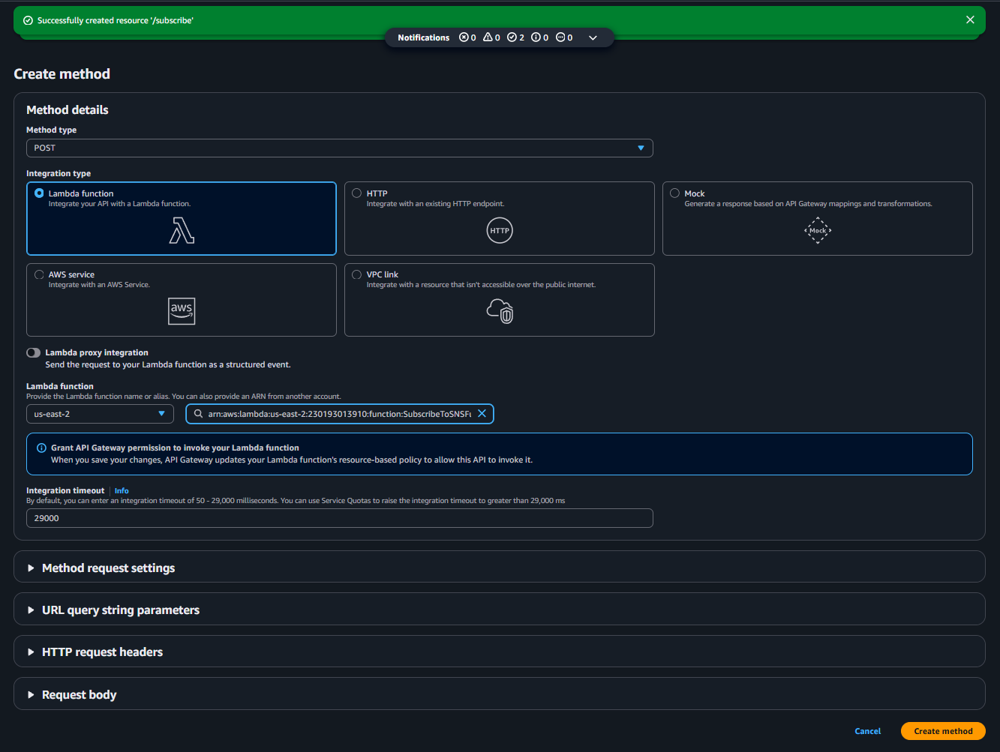
  
  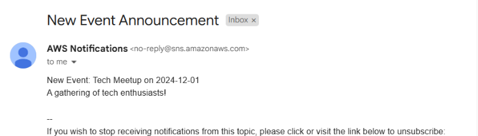
  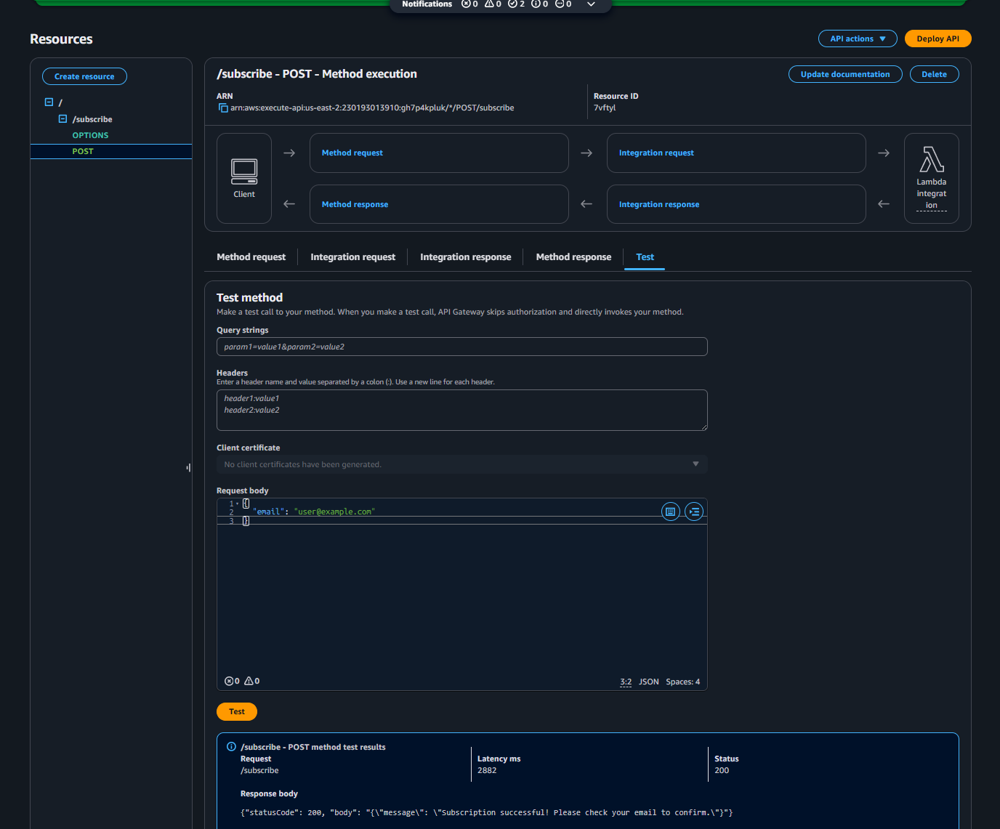

3. **Create Event Flow**:  
   - `/create-event` → API Gateway → Lambda  
   - The `createEventFunction`:
     - Appends new event details to the `events.json` file stored in S3 (`arn:aws:s3:::myevent-announcement-website-s3`)  
     - Notifies all SNS subscribers about the new event  
     - Function permissioned by `myeventcreationLAMBDAroll`

### 📸 Architecture Flow Examples

Here are key screenshots from the configuration and testing process:

**Create Event Flow**
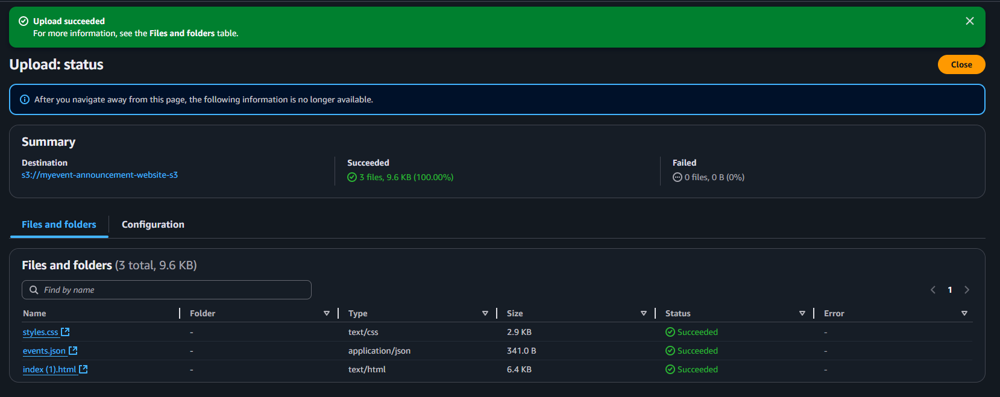
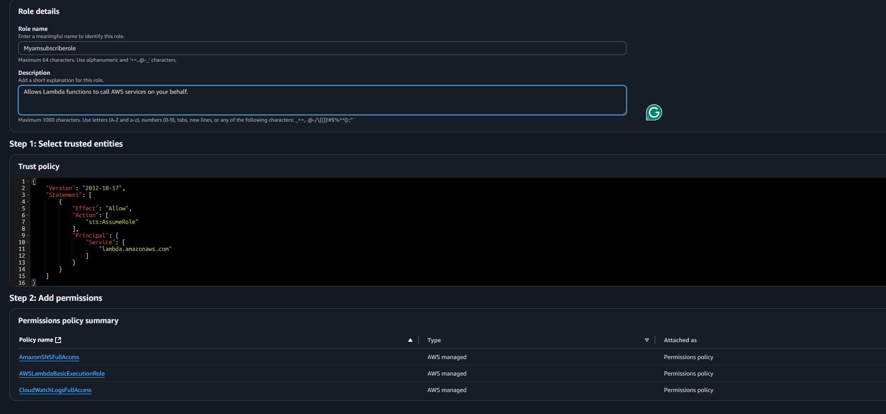
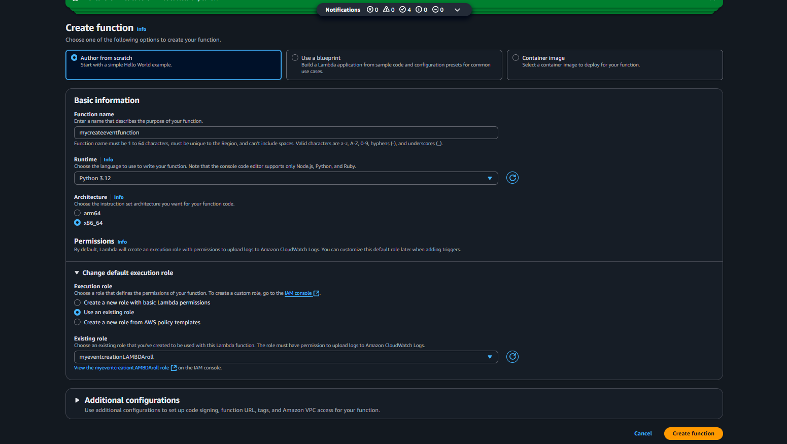
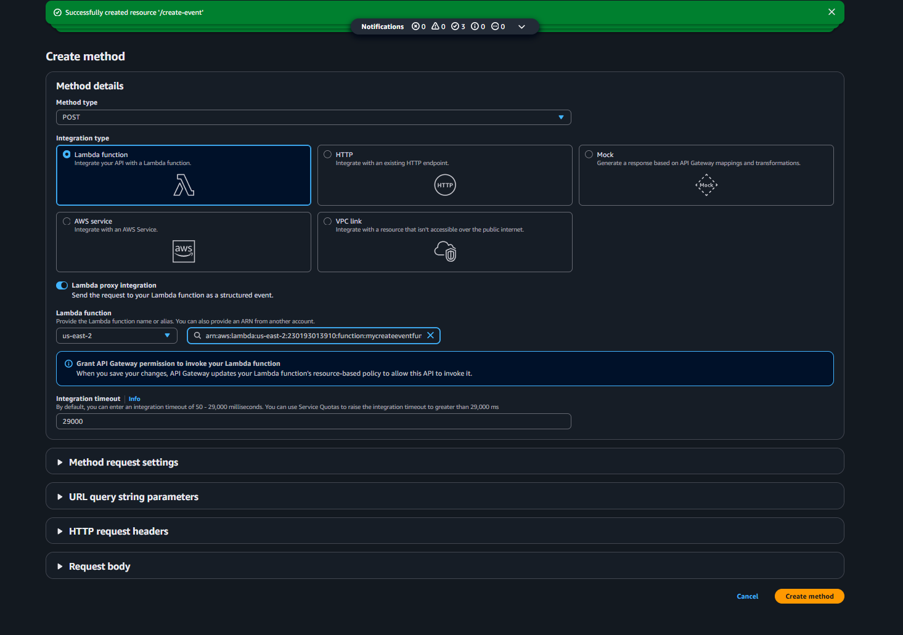
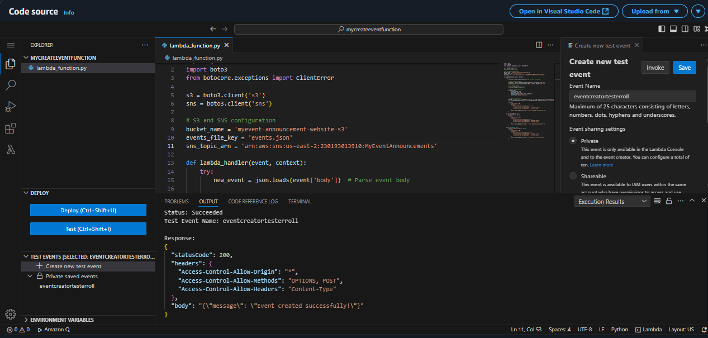

## Setup Steps

1. **Frontend Hosting with S3**  
   - Uploaded `index.html`, `styles.css`, and `events.json`  
   - Enabled static site hosting  
   - Used this bucket ARN: `arn:aws:s3:::myevent-announcement-website-s3`

**Frontend Setup Screenshots**
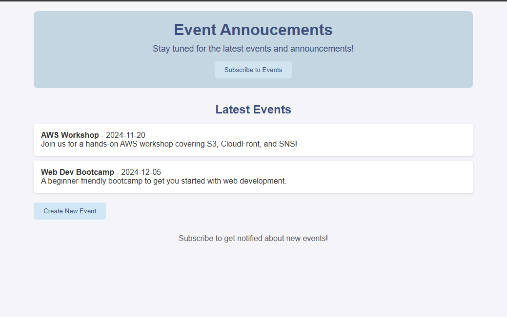
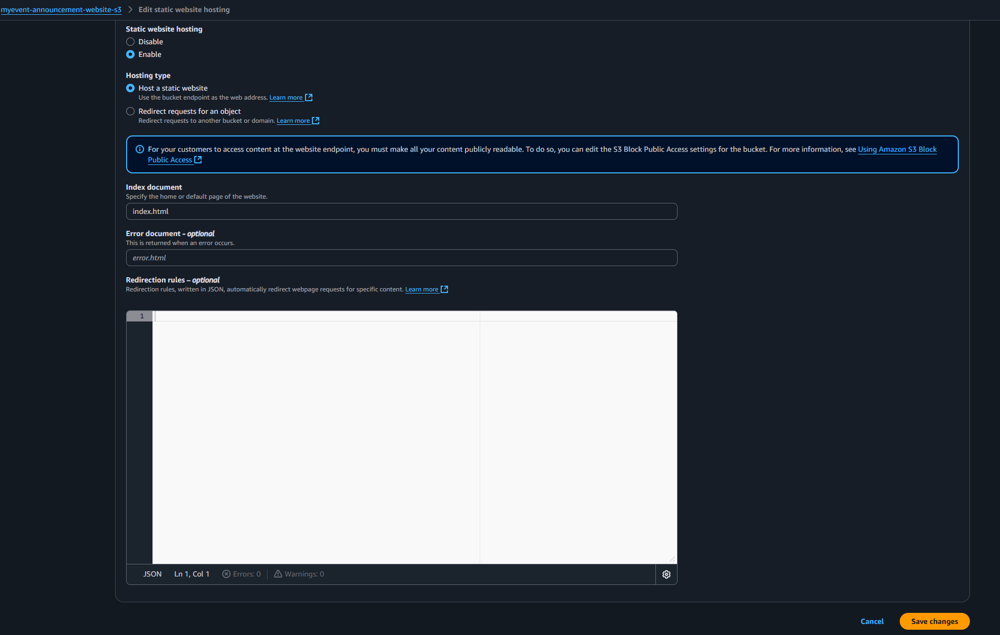

2. **SNS Setup**  
   - Created topic: `MyEventAnnouncements`  
   - ARN: `arn:aws:sns:us-east-2:230193013910:MyEventAnnouncements`  
   - Enabled Lambda to publish to the topic

**SNS Topic Setup**
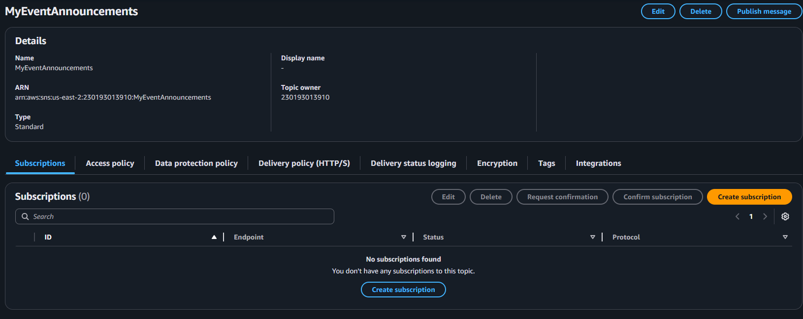
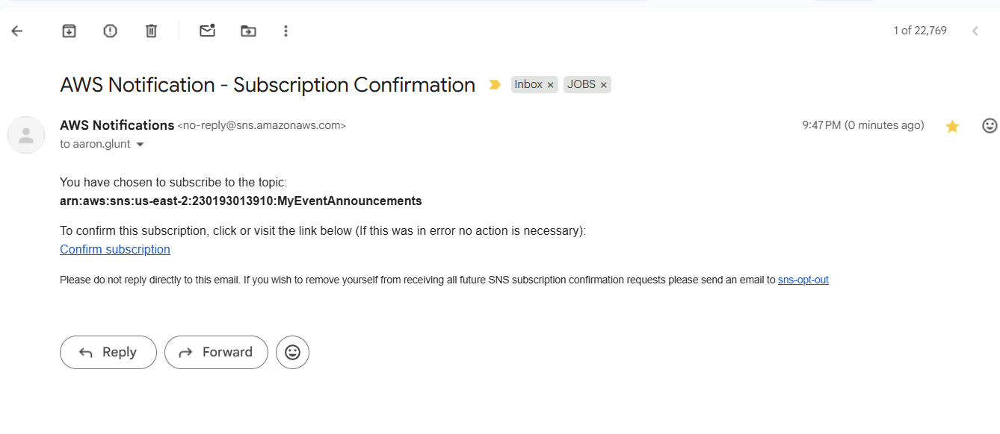

3. **Lambda Functions**  
   - `SubscribeToSNSFunctionlambda`: Manages email subscriptions  
   - `createEventFunction`: Updates events.json and triggers notifications

4. **API Gateway Configuration**  
   - Created REST API: `myEventManagementAPIrest`  
   - Integrated and tested endpoints `/subscribe` and `/create-event`  
   - Enabled CORS  
   - Deployed to stage `dev`:  
     - Subscribe: `https://gh7p4kplu.execute-api.us-east-2.amazonaws.com/dev/subscribe`  
     - Create Event: `https://gh7p4kplu.execute-api.us-east-2.amazonaws.com/dev/create-event`

**SNS Topic Setup**

5. **IAM Roles & Policies**  
   - Created role: `myeventcreationLAMBDAroll` for Lambda permissions  
   - Roles assigned to handle S3 access and SNS publishing securely

## Testing

- Manually tested Lambda and API Gateway connections  
- Verified CORS handling and frontend communication  
- Events successfully posted, stored in S3, and email notifications sent via SNS  
- Responses were parsed and displayed correctly on the site

## Troubleshooting

During the build, I ran into a few issues and fixed them along the way:

- **CORS Problems**  
  My API Gateway wasn’t accepting requests from the frontend — fixed by turning on CORS for each endpoint and redeploying the API.

- **Weird JSON Response from Lambda**  
  Lambda gave me a response with a string inside the body. I had to use `JSON.parse()` twice in my JavaScript to get the actual message out.

- **Site Looked All White After Changes**  
  When I swapped in tutorial code, my styling disappeared. Turned out a broken URL and a missing CSS link caused a JavaScript error that broke the layout. Once I fixed the `fetch()` call and re-checked the CSS file, it worked again.

- **Accidental Line Breaks**  
  There was a sneaky line break in one of my `fetch()` calls — made the code crash silently. I used VS Code to spot it and fix it.

- **Endpoint Security**  
  I kept my real API endpoints out of the repo for safety. I tested everything fully, then removed the live links during cleanup.

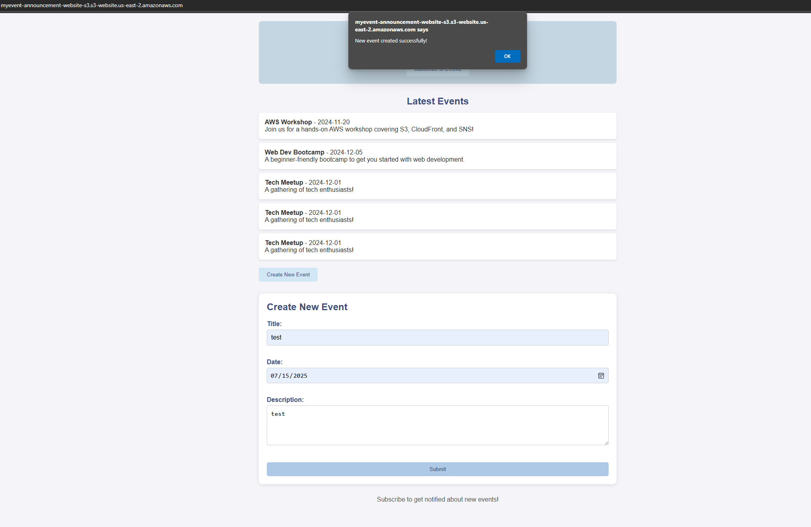

## Clean-Up

Once functionality was confirmed:

- Deleted S3 bucket  
- Deleted Lambda functions: `SubscribeToSNSFunctionlambda` and `createEventFunction`  
- Removed API Gateway endpoints  
- Deleted SNS topic and subscriptions  
- Detached and deleted IAM roles

## Notes

This project was built with a hands-on approach to reinforce real-world AWS architecture. Each component was tested individually before full integration. Permissions followed least-privilege principles, and CORS was validated during deployment.

**Temporary frontend was hosted at:**  
`http://myevent-announcement-website-s3.s3-website.us-east-2.amazonaws.com`  
This site has since been removed during cleanup for security and cost control.
