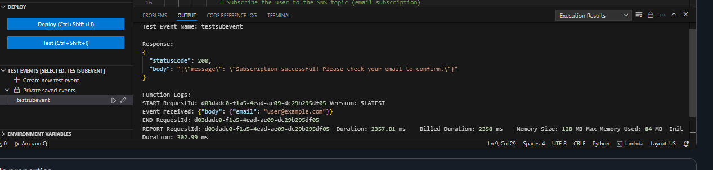

# Event Notification System – Serverless Event Platform

  

## 🎯 Purpose
Cloud-powered event notification platform enabling users to subscribe to event alerts and create announcements through a static website backed by serverless AWS infrastructure.

## 🏗️ Architecture
- **Amazon S3** – Frontend hosting and event data storage
- **Amazon SNS** – Email subscription management and notifications
- **AWS Lambda** – Backend processing logic
- **API Gateway** – RESTful endpoint management
- **IAM** – Secure access control

## ⚙️ Technical Implementation

### Architecture Flow
```
User → S3 Static Site → API Gateway → Lambda → SNS/S3 → Email Notification
```

### Subscribe Flow


**Process:**
1. User submits email via `/subscribe` endpoint
2. API Gateway routes to Lambda function
3. Lambda validates email and adds to SNS topic
4. SNS sends confirmation email


### Create Event Flow


**Process:**
1. User creates event via `/create-event` endpoint
2. Lambda appends event to `events.json` in S3
3. Lambda triggers SNS notification to all subscribers
4. Frontend dynamically loads updated events

### Frontend Deployment


### SNS Configuration


## 🎯 Key Features
- ✅ Serverless architecture with zero server management
- ✅ Real-time event notifications via email
- ✅ Static site hosting with dynamic content loading
- ✅ RESTful API design with CORS support
- ✅ IAM least-privilege security model

## 📊 Technical Highlights
- Event-driven architecture using SNS pub/sub pattern
- S3 static site hosting with API Gateway integration
- Lambda functions for decoupled business logic
- CORS-enabled REST API for frontend communication
- Secure credential management via IAM roles

## 🔧 API Endpoints

### Subscribe Endpoint
```javascript
POST /subscribe
{
  "email": "user@example.com"
}
```

### Create Event Endpoint
```javascript
POST /create-event
{
  "title": "Event Name",
  "date": "2024-01-01",
  "description": "Event details"
}
```

## 🔒 Security Implementation
- IAM roles with least-privilege access
- API Gateway authorization
- CORS configuration for cross-origin requests
- SNS subscription confirmation workflow
- Secure credential management


## 📈 Use Cases
- Event management platforms
- Community announcement systems
- Newsletter subscription services
- Real-time notification systems
- Marketing campaign platforms

## 🎓 Architecture Decisions
- **S3 for hosting**: Cost-effective static site delivery
- **SNS for notifications**: Scalable pub/sub messaging
- **Lambda for logic**: Pay-per-execution serverless compute
- **API Gateway for APIs**: Managed REST endpoint infrastructure

---

**Built with:** AWS Lambda | S3 | SNS | API Gateway | IAM | Python

**Tags:** `aws` `serverless` `lambda` `s3` `sns` `api-gateway` `event-driven` `notifications`
